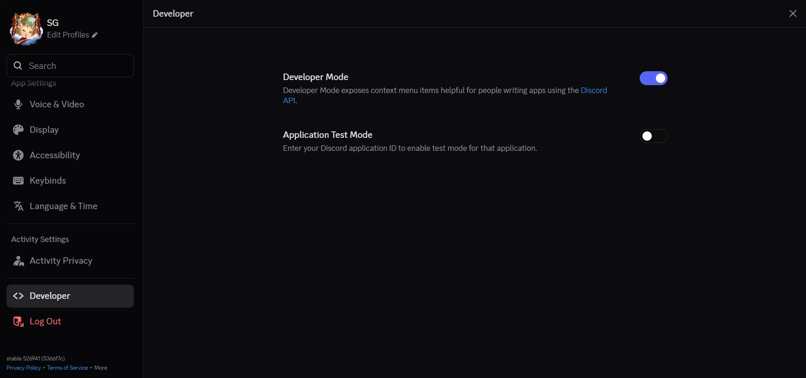
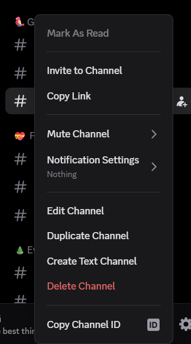
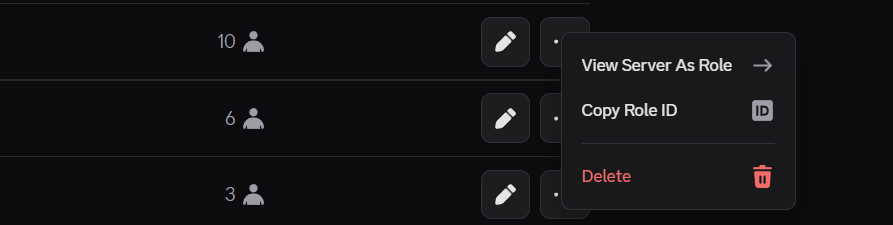

# Declaring ENVs

### Prerequisites

- Make sure you have developer Mode on in Discord via Settings
  
- Know how to get ChannelID, RoleID & many more, etc (Right Click and you will have a new option called Copy XYZ ID)
  
  

# Go through .env.example file

Here is the file link [`.env.example`](../.env.example)

# MOST IMPORTANT

## Use Online Postgres service (Beginner Friendly)

- Use `Neon` - Exceptional Database Online by Vercel!

## If your using postgres on host

- Edit `postgres.conf` in /etc/postgres folder for listening address to listen to your `PRIVATE IP`
- use `host.containers.internal` for Podman or `host.docker.internal` for docker.

## If postgres on docker

- Edit the `docker-compose.yml` and derive the connection string
- Example code is available online and append it to docker-compose.yml

### EXTRA INFORMATION

- Increase SWAP of the VM
- Get a Cron Job that runs every 20mins with

```
$ crontab -e
# Paste this line in the file
$ */20 * * * * podman restart libretranslate
```

- LibreTranslate consumes alot or RAM even when inactive and it accumulates alot in longterm so restarting it does no harm.
- You can also add LingvaTranslate if you want but don't have the bot container restart.
